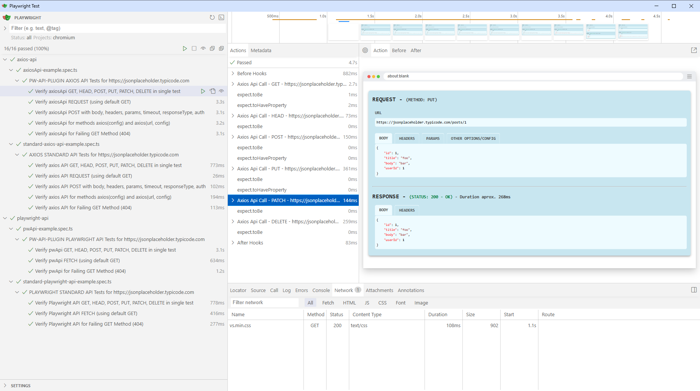

# PW-API-PLUGIN-SAMPLE-PROJECT

This project offers examples of how to use the `pw-api-plugin` in your Playwright setup to simplify and enhance API testing. It also provides detailed guidance on converting a standard Playwright project, which uses Playwright's standard methods or Axios methods, into one that leverages the `pw-api-plugin`.



## About the PW-API-PLUGIN

`PW-API-PLUGIN` is a plugin for Playwright test framework that enhances your API testing experience.

Allow comprehensive API testing, presenting the results in a user-friendly way in the Playwright UI, Trace Viewer, and HTML Report as attachments. It significantly aids debugging processes and supports both Playwright's native API and Axios requests.

For more details, visit the [pw-api-plugin GitHub repository](https://github.com/sclavijosuero/pw-api-plugin).


## Testing with Playwright API Methods

### Examples of Standard Playwright API Tests

[tests\playwright-api\standard-playwright-api-example.spec.ts](tests\playwright-api\standard-playwright-api-example.spec.ts)

### Examples of PW-API-PLUGIN Tests Using Playwright API (Class `pwApi`)

[tests\playwright-api\pwApi-example.spec.ts](tests\playwright-api\pwApi-example.spec.ts)

> ✨This test file contains the same tests as _tests\playwright-api\standard-playwright-api-example.spec.ts_ but using the class `pwApi` of the `pw-api-plugin`.

### Converting Existing Playwright API Tests to PW-API-PLUGIN

#### 1. Replace Imports

Replace:

```js
import { expect, test } from '@playwright/test';
```

With:

```js
import { expect } from '@playwright/test';
import { pwApi, test } from 'pw-api-plugin';
```

#### 2. Replace Parameters in Your Async Tests Definitions

Replace:

```js
test('<Your test name>', async ({ request }) => {
```

With:

```js
test('<Your test name>', async ({ request, page }) => {
```

#### 3. Replace Methods

To convert your existing Playwright project that utilizes the Playwright Standard API to the `pw-api-plugin`, replace the following strings in all your files as follows:

- `await request.get(` with `await pwApi.get({ request, page }, `
- `await request.head(` with `await pwApi.head({ request, page }, `
- `await request.post(` with `await pwApi.post({ request, page }, `
- `await request.put(` with `await pwApi.put({ request, page }, `
- `await request.patch(` with `await pwApi.patch({ request, page }, `
- `await request.delete(` with `await pwApi.delete({ request, page }, `
- `await request.fetch(` with `await pwApi.fetch({ request, page }, `


## Testing with Axios API Methods in Playwright

### Examples of Axios API Tests

[tests\axios-api\standard-axios-api-example.spec.ts](tests\axios-api\standard-axios-api-example.spec.ts)

### Examples of PW-API-PLUGIN Tests Using Axios API (Class `axiosApi`)

[tests\axios-api\axiosApi-example.spec.ts](tests\axios-api\axiosApi-example.spec.ts)

> ✨ This test file contains the same tests as _tests\axios-api\standard-axios-api-example.spec.ts_ but using the class `axiosApi` of the `pw-api-plugin`.

### Converting Existing Axios API Testing Projects in Playwright to PW-API-PLUGIN

#### 1. Replace Imports

Replace:

```js
import { expect, test } from '@playwright/test';
import axios from 'axios';
```

With:

```js
import { expect } from '@playwright/test';
import { axiosApi, test } from 'pw-api-plugin';
```

#### 2. Replace Parameters in Your Async Tests Definitions

Replace:

```js
test('<Your test name>', async () => {
```

With:

```js
test('<Your test name>', async ({ page }) => {
```

#### 3. Replace Methods

To convert Axios-based API tests in your Playwright project to use the `pw-api-plugin`, replace the following strings in all your files as follows:

- `await axios(` with `await axiosApi.axios({ page }, `
- `await axios.request(` with `await axiosApi.request({ page }, `
- `await axios.get(` with `await axiosApi.get({ page }, `
- `await axios.post(` with `await axiosApi.post({ page }, `
- `await axios.put(` with `await axiosApi.put({ page }, `
- `await axios.patch(` with `await axiosApi.patch({ page }, `
- `await axios.delete(` with `await axiosApi.delete({ page }, `
- `await axios.head(` with `await axiosApi.head({ page }, `
- `await axios.options(` with `await axiosApi.options({ page }, `
- `await axios.postForm(` with `await axiosApi.postForm({ page }, `
- `await axios.putForm(` with `await axiosApi.putForm({ page }, `
- `await axios.patchForm(` with `await axiosApi.patchForm({ page }, `


## Running Tests

### Display API Resquest and Response Details in Playwright UI as API Cards

```shell
npx playwlright test --ui
```

Also equivalent to:

```shell
$env:LOG_API_UI="true"
npx playwlright test --ui
```

> By default environment variable `LOG_API_UI` is enabled.


### Display API Resquest and Response Details in Trace Viewer

```shell
npx playwlright test --ui --trace=on
```

Also equivalent to:

```shell
$env:LOG_API_UI="true"
npx playwlright test --ui --trace=on
```

> By default environment variable `LOG_API_UI` is enabled.


### Display API Resquest and Response Details in HTML Report as attachments

```shell
$env:LOG_API_REPORT="true"
npx playwlright test --ui
```

> By default environment variable `LOG_API_LOG_API_REPORT` is disabled.
